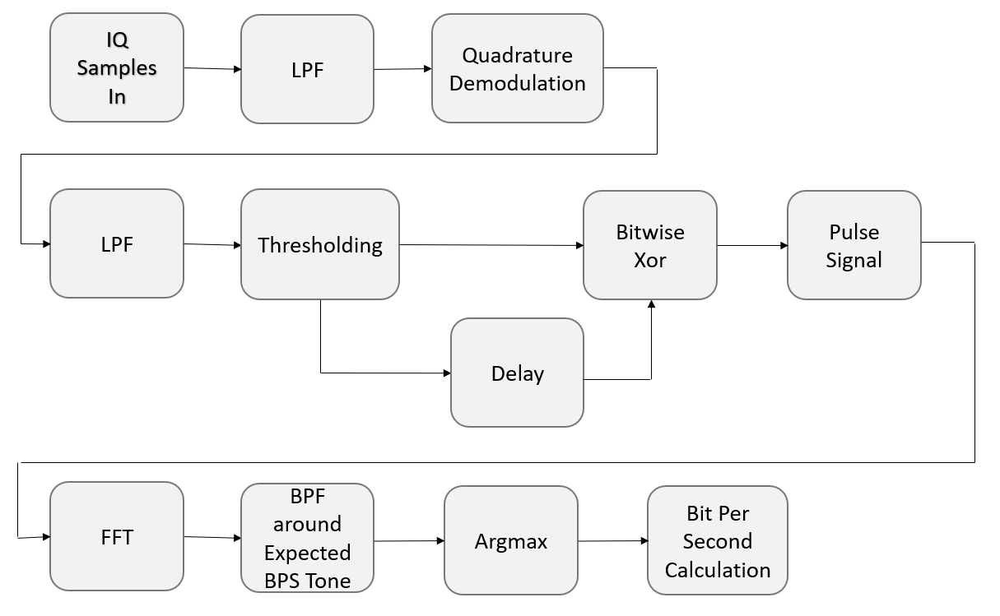

<h1>Software-Defined-Radio-FSK-Tool</h1>

SDR Script which calculates FSK Bitrate using a generic RTLSDR device and numpy/scipy DSP (mainly)

Written in Python 3.9

<h1>Dependencies</h1>

pip install numpy

pip install scipy

pip install matplotlib

These scripts use the SoapySDR Python API to get IQ Samples from the SDR being used

SoapySDR can be used on Windows 10 from the PothosSDR Package Manager.  Windows pre-compiled binaries of PothosSDR can be found here: https://downloads.myriadrf.org/builds/PothosSDR/

<h1>Theory of Operation</h1>

Inspiration/theoretical basis for this tool came from https://www.youtube.com/watch?v=rQkBDMeODHc and Chapter 7 of Modern Digital and Analog Communication Systems by Lathi, Ding

The Scripts works by demodulating the FM signal using quadrature demodulation to get instantaneous frequency (for 2-FSK, you will see the frequency swing from a negative frequency to a postive frequency: this respresents the bits when viewed over time). The bits are cleaned up using thesholding. A pulse signal is generated at the rising/falling edge of each Non-Return to Zero (NRZ) bit(s) using a delay and XOR operation.  When the fast fourier transform (FFT) of this pulse signal is taken, the first non-DC tone is the clock rate/bit rate of the signal.  The tone can be extracted using a bandpass filter and the bit rate can be calculated by the relation: tone_bin_number/fft_bins = bps(Hz)/sample-rate(Hz).  This tool is ideal for a non-streaming high SNR application, such as used as for manufacting testing or engineering verification.

The Block Diagram of the Main Script is as Follows:

<h1>Test Scripts for FSK Tool</h1>

Two Testing Scripts are included to verify the long term performance of tool.  One will work with the LFM and the other will work with the E4422B Signal Generator

